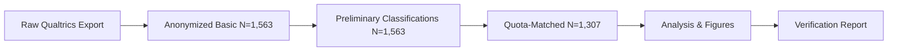

# Climate Finance Research — Reproducible Pipeline


**Version 5.0.1** | **Last Updated:** 2025-08-09 (UTC)

## 📑 Table of Contents

- [Overview](#-overview)
- [Getting Started](#-getting-started)
  - [Prerequisites](#prerequisites)
  - [Quick Start Commands](#quick-start-commands)
- [Repository Structure](#-repository-structure)
- [Configuration Files](#-configuration-files)
- [Pipeline Architecture](#️-pipeline-architecture)
  - [Processing Stages](#processing-stages)
  - [Data Flow](#data-flow)
- [Data Outputs](#-data-outputs)
  - [Core Public Artifacts](#core-public-artifacts-always-generated)
  - [Analysis Outputs](#analysis-outputs-with---with-analysis-flag)
- [Appendix J Configuration](#-appendix-j-configuration)
  - [Target Distribution](#target-distribution)
  - [Category Universe](#category-universe-23-categories)
- [Privacy & Data Security](#-privacy--data-security)
- [Statistical Analysis](#-statistical-analysis)
  - [Hypothesis Testing Framework](#hypothesis-testing-framework)
- [Environment & Reproducibility](#️-environment--reproducibility)
  - [Package Management with renv](#package-management-with-renv)
- [Team Collaboration](#-team-collaboration)
  - [For New Team Members](#for-new-team-members)
  - [Code Style Guidelines](#code-style-guidelines)
  - [Contributing Workflow](#contributing-workflow)
- [Troubleshooting & Validation](#-troubleshooting--validation)
  - [Common Issues and Solutions](#common-issues-and-solutions)
  - [Validation Functions](#validation-functions)
  - [File Naming Conventions](#file-naming-conventions)
- [Project Information](#-project-information)
  - [Study Details](#study-details)
  - [Data Collection](#data-collection)
- [Data Availability](#-data-availability)
- [Citation](#-citation)
- [Contact & Support](#-contact--support)
- [License](#-license)
- [Changelog](#️-changelog)
- [Reference URLs](#-reference-urls)
- [Future Development](#-future-development)

---

## 📋 Overview

This repository contains a complete, deterministic, and privacy-preserving R pipeline for the manuscript:

> **The Capital–Opportunity Mismatch: A Multi-Stakeholder Analysis of Climate Finance Barriers and Solutions**

The pipeline provides end-to-end transformation from **raw Qualtrics export** → **anonymized public data** → **Appendix J classifications** → **quota-matched analysis subset** → **manuscript figures/tables**, with comprehensive verification artifacts (checksums, logs, and verification reports).

### Core Capabilities

- **Deterministic Processing**: Seed 1307 + UTC timezone ensures reproducible outputs
- **Central Configuration**: `R/00_config.R` serves as single source of truth for all paths, seed, IO, and QA settings
- **Privacy-First Design**: Strict PII scrubbing with geography limited to region-level only
- **Data Integrity**: No synthetic/proxy variables; analyses use only real observed data
- **Quality Assured**: Automated QA suite (`R/99_quality_checks.R`) with verification artifacts
- **Deprecation Guard**: Active detection and warnings for legacy filenames
- **Appendix J Compliance**: Corrected distribution with Miscellaneous = 151 and Entrepreneur = 107 (total N=1,307)
- **Verification by Default**: `run_all.R` runs with verification enabled (use `--no-verify` to skip)

---

## 🚀 Getting Started

### Prerequisites

1. **R Installation**: Version 4.5+ recommended (tested with 4.5.1)
2. **RStudio** (optional but recommended): Latest version
3. **Raw Data**: Place Qualtrics export CSV in `data_raw/` directory
4. **Package Management**: Run `renv::restore()` after cloning
5. **Git**: For version control and collaboration

### Quick Start Commands

```bash
# First-time setup (after cloning)
R -e "renv::restore()"

# Basic pipeline: generate anonymized datasets, preliminary classifications, dictionary + verify
Rscript run_all.R --clean

# Full pipeline: include figure/table generation and hypothesis testing on the N=1,307 subset
Rscript run_all.R --clean --with-analysis

# Verification only: run integrity checks, generate checksums, and create verification report
Rscript run_all.R --verify

# Display all available flags and options
Rscript run_all.R --help
```

---

## 📁 Repository Structure

```
climate-finance-research/
├── .gitignore                              # Data privacy rules and version control exclusions
├── .editorconfig                           # Code formatting standards
├── .Rprofile                               # Auto-activates renv
├── renv.lock                               # Package version snapshot (118 packages locked)
├── renv/                                   # Project library (git-ignored)
├── R/                                      # Core pipeline scripts
│   ├── 00_config.R                        # Central configuration (seed=1307, UTC, paths, QA, IO)
│   ├── 01_anonymize_data.R                # PII removal, dictionary, stable respondent IDs
│   ├── 02_classify_stakeholders.R         # Stakeholder classification (Appendix J, v6.0)
│   ├── get_exact_1307.R                   # Deterministic quota-matching to N=1,307
│   ├── 02_main_analysis.R                 # Analysis wrapper with validation
│   ├── 03_main_analysis.R                 # Main statistics & figures (final N=1,307)
│   ├── 04_hypothesis_testing.R            # Hypothesis tests with safeguards and corrections
│   ├── 99_quality_checks.R                # QA suite, checksums, verification hooks
│   ├── appendix_j_config.R                # **Canonical** target distribution & helpers
│   ├── filter_and_adjust_classifications.R# Audit tool for deficits vs targets, donor pool
│   └── manual_classification_correction.R # Manual fixes for edge cases
│
├── data/                                   # Processed data outputs
│   ├── survey_responses_anonymized_basic.csv         # Anonymized baseline (N=1,563)
│   ├── survey_responses_anonymized_preliminary.csv   # With preliminary roles (N=1,563)
│   ├── climate_finance_survey_final_1307.csv        # Final analysis subset (N=1,307)*
│   └── data_dictionary.csv                          # Column definitions & completeness
│
├── data_raw/                               # Input data location
│   └── [Place raw Qualtrics export CSV(s) here]
│
├── docs/                                   # Documentation
│   ├── data_schema.md                     # Schema, naming conventions, privacy rules
│   ├── appendix_j_methodology.md          # Eligibility, classification, quota methodology
│   ├── appendix_j_classification_template.csv       # Manual harmonization template (N=1,563)
│   ├── verification_report.md             # Timestamp, commit hash, artifact presence
│   └── checksums.txt                      # SHA256 checksums of public artifacts
│
├── output/                                 # Analysis results, logs, audits, tables*
├── figures/                                # Publication-ready figures*
├── run_all.R                              # Main pipeline runner (v5.0)
├── renv.lock                              # Package management for reproducibility
├── LICENSE                                # Code: MIT; Data & docs: CC BY 4.0
└── climate-finance-research.Rproj        # RStudio project file

* Generated only with --with-analysis flag
```

---

## 🔧 Configuration Files

### Repository Configuration
- **`.gitignore`**: Protects sensitive data and raw files from version control
- **`.editorconfig`**: Ensures consistent code formatting across all contributors
- **`.Rprofile`**: Auto-activates renv when R starts in this project
- **`renv.lock`**: Locks exact package versions for reproducibility (118 packages)
- **`LICENSE`**: MIT for code, CC BY 4.0 for data and documentation

### Privacy Protection
The `.gitignore` file specifically excludes:
- All raw data files (`data_raw/`)
- Files containing PII patterns (`*email*`, `*Q2.2*`, etc.)
- Deprecated file names to prevent accidental commits
- Temporary and system files (`.DS_Store`, `*.tmp`, etc.)
- R session files and history

---

## 🏗️ Pipeline Architecture

### Processing Stages

The pipeline executes five sequential stages, each with built-in validation:

#### 1. **Anonymization** (`R/01_anonymize_data.R`)
- Removes all PII (names, emails, organizations, phone/IP, addresses)
- Standardizes geography to region-level only
- Buckets dates to YYYY-MM format
- Generates data dictionary and stable hashed `respondent_id`
- **Output:** `survey_responses_anonymized_basic.csv`

#### 2. **Classification** (`R/02_classify_stakeholders.R`)
- Implements two-stage Appendix J assignment:
  - Direct rules for known categories
  - Harmonization for "Other" text responses
- Writes preliminary roles and classification audit CSV
- **Output:** `survey_responses_anonymized_preliminary.csv`

#### 3. **Quota-Matching** (`R/get_exact_1307.R`)
- Performs deterministic, non-destructive matching to Appendix J targets
- Preserves original classifications
- Logs all reassignments and verification statistics
- **Output:** `climate_finance_survey_final_1307.csv` (with `--with-analysis`)

#### 4. **Analysis** (`R/02_main_analysis.R`, `R/03_main_analysis.R`, `R/04_hypothesis_testing.R`)
- Generates descriptive statistics, figures, and hypothesis tests
- Implements multiple-testing safeguards
- Never uses raw Q2.2 geography (privacy guardrails enforced)
- **Output:** Tables in `output/`, figures in `figures/`

#### 5. **Quality & Verification** (`R/99_quality_checks.R`)
- Validates each stage
- Scans for deprecated files
- Verifies sample sizes
- Generates checksums
- **Output:** `docs/verification_report.md`, `docs/checksums.txt`

### Data Flow



---

## 📊 Data Outputs

### Core Public Artifacts (Always Generated)

| File | Description | Records |
|------|-------------|---------|
| `data/survey_responses_anonymized_basic.csv` | Fully anonymized dataset (PII removed) | 1,563 |
| `data/survey_responses_anonymized_preliminary.csv` | Anonymized + preliminary Appendix J roles | 1,563 |
| `docs/appendix_j_classification_template.csv` | Harmonization/audit template | 1,563 |
| `data/data_dictionary.csv` | Column metadata & completeness | — |

### Analysis Outputs (With `--with-analysis` Flag)

| File/Directory | Description |
|----------------|-------------|
| `data/climate_finance_survey_final_1307.csv` | Deterministic quota-matched analysis subset |
| `output/` | Statistical results, hypothesis tests, tables |
| `figures/` | Publication-ready figures |

**Note:** The manuscript uses the N=1,307 subset for all inferential analyses. Public datasets expose the full N=1,563 anonymized responses.

---

## 📐 Appendix J Configuration

### Target Distribution

Targets are defined exclusively in `R/appendix_j_config.R` and must sum to 1,307.

**Critical fixes (2025-08-09):**
- Miscellaneous and Individual Respondents = **151** (was 99)
- Entrepreneur in Climate Technology = **107** (was 159)
- Total unchanged at **1,307**

### Category Universe (23 Categories)

1. Entrepreneur in Climate Technology
2. Venture Capital Firm
3. Investment and Financial Services
4. Private Equity Firm
5. Business Consulting and Advisory
6. Nonprofit Organization
7. High Net-Worth Individual
8. Government Funding Agency
9. Academic or Research Institution
10. Limited Partner
11. Family Office
12. Corporate Venture Arm
13. Angel Investor
14. ESG Investor
15. Legal Services
16. Corporate Entities
17. Manufacturing and Industrial
18. Energy and Infrastructure
19. Real Estate and Property
20. Philanthropic Organization
21. Technology and Software
22. Media and Communication
23. Miscellaneous and Individual Respondents

For audits and adjustments, use `R/filter_and_adjust_classifications.R` to analyze deficits vs targets and donor pools. The canonical target table and validations are in `R/appendix_j_config.R`.

---

## 🔒 Privacy & Data Security

### Privacy Safeguards

- **PII Removal at Source**: Names, emails, organizations, phone/IP, addresses, exact locations
- **Geographic Aggregation**: Region-level only (Europe, North America, Asia, Other); raw Q2.2 never persists
- **Temporal Resolution**: Maximum resolution YYYY-MM where required
- **Identifier Management**: Deterministic SHA-256 hashes, stable across stages
- **Consent Compliance**: Only responses with explicit consent included
- **Automated Validation**: Privacy checks with pipeline halt on violations (strict mode)

See `docs/data_schema.md` for detailed column naming conventions and privacy specifications.

---

## 🧪 Statistical Analysis

### Hypothesis Testing Framework

`R/04_hypothesis_testing.R` implements the study's H-series hypotheses with comprehensive safeguards:

- **Small-cell checks** to protect against disclosure
- **Multiple-testing corrections** (Bonferroni/FDR)
- **Analysis domains**: Technology risk perception, market barriers, geographic effects, impact orientation
- **Survey items analyzed**: Q3.6_*, Q3.11_*, Q3.3, and related measures
- **Sample**: N=1,307 quota-matched subset

**Important:** No synthetic or proxy variables are generated; only observed data are used in analyses.

---

## ⚙️ Environment & Reproducibility

### Determinism & IO Conventions

- **Random Seed**: `PIPELINE_SEED <- 1307` (enforced in `R/00_config.R`)
- **Timezone**: UTC for all date/time operations
- **CSV Writing**: `readr::write_csv(..., na = "")` to avoid NA artifacts
- **Path Resolution**: All scripts use centralized `PATHS` from `R/00_config.R`

### Package Management with renv

This project uses renv for reproducible package management. All package versions are locked in `renv.lock`.

#### Initial Setup (for new users)
```r
# Clone the repository, then:
install.packages("renv")
renv::restore()  # This installs all packages with exact versions
```

#### Package Versions Locked
- **R version**: 4.5.1
- **Total packages**: 118
- **Key versions**: tidyverse 2.0.0, dplyr 1.1.4, ggplot2 3.5.1
- **Analysis packages**: lavaan 0.6-19, psych 2.4.6.26, effectsize 0.8.9

#### Adding New Packages (for maintainers)
```r
install.packages("new_package")
renv::snapshot()  # Update renv.lock
git add renv.lock
git commit -m "Add new_package to dependencies"
```

#### Manual Installation Fallback

If renv is unavailable, install packages manually:

```r
# Core packages (required for basic pipeline)
install.packages(c(
  "readr", "dplyr", "tidyr", "stringr", "purrr", 
  "cli", "digest", "lubridate", "tibble"
))

# Additional packages for analysis (--with-analysis)
install.packages(c(
  "ggplot2", "psych", "lavaan", "scales", "corrplot", 
  "broom", "effectsize", "car", "nnet", "MASS"
))
```

---

## 👥 Team Collaboration

### For New Team Members
1. Clone the repository: `git clone https://github.com/richardcmckinney/climate-finance-research.git`
2. Open `climate-finance-research.Rproj` in RStudio
3. Run `renv::restore()` in R console to install all required packages
4. Place raw data in `data_raw/` (request from project lead if needed)
5. Run `Rscript run_all.R --clean` to generate anonymized datasets
6. Run `Rscript run_all.R --clean --with-analysis` for full analysis

### Code Style Guidelines
- Follow [tidyverse style guide](https://style.tidyverse.org/)
- Use 2-space indentation (enforced by `.editorconfig`)
- Maximum line length: 100 characters for R code
- Use `<-` for assignment, not `=`
- Comment complex logic and all functions
- Use meaningful variable names (prefer `stakeholder_classification` over `sc`)

### Contributing Workflow
1. Create a feature branch: `git checkout -b feature/your-feature-name`
2. Make changes and test locally
3. Run quality checks: `source("R/99_quality_checks.R"); run_quality_checks()`
4. Commit with descriptive messages
5. Push and create pull request
6. Ensure all verification checks pass

---

## 🧩 Troubleshooting & Validation

### Common Issues and Solutions

| Symptom | Solution |
|---------|----------|
| "No CSV files found in data_raw" | Place raw Qualtrics export(s) in `data_raw/` and re-run |
| "Deprecated file found" | Delete or rename legacy files (see list below) and re-run |
| "Privacy violation detected" | Re-run anonymization; ensure no raw Q2.2 or PII columns persist |
| "Role column not found" | Ensure canonical role column (e.g., `Final_Role_Category`) exists after classification |
| "Progress/completion missing" | Raw export must include Progress/completion-like columns for eligibility filters |

### Validation Functions

```r
# Stage validation and deprecation checks
check_deprecated(TRUE)
validate_stage("anonymize")  # Options: classify | quota | analyze | verify

# Privacy and quality assurance
check_privacy_violations(df)       # Stops in strict mode if violations detected
run_quality_checks()
generate_checksums()

# Appendix J audits
source("R/filter_and_adjust_classifications.R")  # Analyze deficits vs targets, donor pools
```

### File Naming Conventions

#### ❌ DEPRECATED (Delete if Found)
- `data/climate_finance_survey_classified.csv`
- `data/climate_finance_survey_anonymized.csv`
- `data/survey_classified.csv`
- `data/survey_anonymized.csv`

#### ✅ CORRECT (Current Pipeline)
- `data/survey_responses_anonymized_basic.csv`
- `data/survey_responses_anonymized_preliminary.csv`
- `data/climate_finance_survey_final_1307.csv` (created with `--with-analysis`)

---

## 📚 Project Information

### Study Details

- **Author**: Richard McKinney (richardmckinney@pm.me)
- **Institution**: University of Oxford
- **ORCID**: 0009-0007-1386-6881
- **Ethics Approval**: Oxford CUREC (Ref: SOGE C1A24102)

### Data Collection

- **Collection Period**: June–August 2024
- **Sampling Frame**: 18,964 professionals from 47,832 climate transactions (PitchBook 2010–2024)
- **Response Rate**: 7.3% (1,307 usable from 17,892 delivered)
- **Geographic Coverage**: 42 countries aggregated to 4 regions

See `docs/verification_report.md` and `docs/checksums.txt` for data integrity and provenance details.

---

## 📊 Data Availability

- **Anonymized Data**: Available in this repository (N=1,563)
- **Analysis Subset**: Generated via pipeline (N=1,307)
- **Raw Data**: Not publicly available due to PII/ethics restrictions
- **Replication**: Full pipeline provided for transparency
- **Data Request**: Contact author for collaboration opportunities

---

## 📖 Citation

### Plain Text
McKinney, R. (2025). The Capital–Opportunity Mismatch: A Multi-Stakeholder Analysis of Climate Finance Barriers and Solutions. University of Oxford.

### BibTeX
```bibtex
@article{mckinney2025capital,
  title={The Capital–Opportunity Mismatch: A Multi-Stakeholder Analysis of Climate Finance Barriers and Solutions},
  author={McKinney, Richard},
  year={2025},
  institution={University of Oxford}
}
```

---

## 📧 Contact & Support

- **Author**: Richard McKinney
- **Email**: richardmckinney@pm.me
- **ORCID**: [0009-0007-1386-6881](https://orcid.org/0009-0007-1386-6881)
- **Issues**: Use [GitHub Issues](https://github.com/richardcmckinney/climate-finance-research/issues) for bug reports
- **Questions**: Open a [Discussion](https://github.com/richardcmckinney/climate-finance-research/discussions) on GitHub
- **Institution**: University of Oxford

---

## 📄 License

- **Code**: MIT License
- **Data & Documentation**: CC BY 4.0

See `LICENSE` file for full details.

---

## 🗂️ Changelog

### v5.0.1 (2025-08-09)
- Added comprehensive repository configuration files (`.gitignore`, `.editorconfig`)
- Implemented renv for package management reproducibility
- Enhanced documentation with detailed setup instructions
- Fixed classification script file reference (`04_hypothesis_testing.R`)
- Added `manual_classification_correction.R` for edge case handling
- Improved README structure and clarity

### v5.0 (2025-08-09)
- Enhanced runner with improved flags (`--verify` default on, `--no-verify`, `--checkpoint`, `--force`)
- Strengthened determinism (seed=1307, UTC, na="" writes) across all scripts
- Standardized verification artifacts (`checksums.txt`, `verification_report.md`)
- Harmonized documentation and layout with deprecation guards

### v4.x
- Appendix J corrections: Miscellaneous = 151, Entrepreneur = 107 (N=1,307 total)
- Re-ordered classification logic, bug-fixed joins, stricter privacy, consolidated helpers

### v1–3
- Initial implementation of anonymization → classification → analysis pipeline

---

## 🔗 Reference URLs

- **GitHub Repository**: https://github.com/richardcmckinney/climate-finance-research
- **renv Documentation**: https://pkgs.rstudio.com/renv/reference/restore.html
- **Posit renv Overview**: https://docs.posit.co/ide/user/ide/guide/environments/r/renv.html
- **readr write_csv Documentation**: https://readr.tidyverse.org/reference/write_delim.html

---

## 🚀 Future Development

### Planned Enhancements

- [ ] **CI/CD Pipeline**: Implement GitHub Actions for automated testing
  - Run `Rscript run_all.R --verify` on every push
  - Fail on privacy violations or deprecated files
  - Generate verification reports automatically

- [ ] **Containerization**: Create Docker container for environment
  - Ensure perfect reproducibility across systems
  - Include all dependencies and R version
  - Enable cloud-based execution

- [ ] **Interactive Dashboard**: Add Shiny application for results exploration
  - Dynamic filtering by stakeholder category
  - Interactive visualizations of barriers and solutions
  - Real-time hypothesis testing interface

- [ ] **Automated Reporting**: Implement data quality reports
  - Weekly integrity checks
  - Anomaly detection in new data
  - Automated classification confidence scores

- [ ] **Testing Framework**: Add comprehensive unit tests
  - Test all critical functions in pipeline
  - Validate privacy preservation
  - Ensure classification accuracy

- [ ] **Extended Analysis**: Additional statistical methods
  - Machine learning classification models
  - Network analysis of stakeholder relationships
  - Time-series analysis for longitudinal studies

### Contributing

We welcome contributions! Please see the [Team Collaboration](#team-collaboration) section for guidelines.